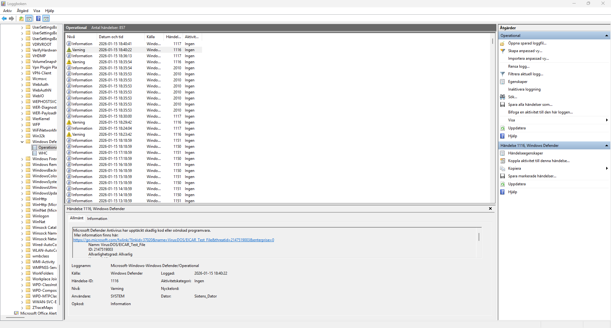
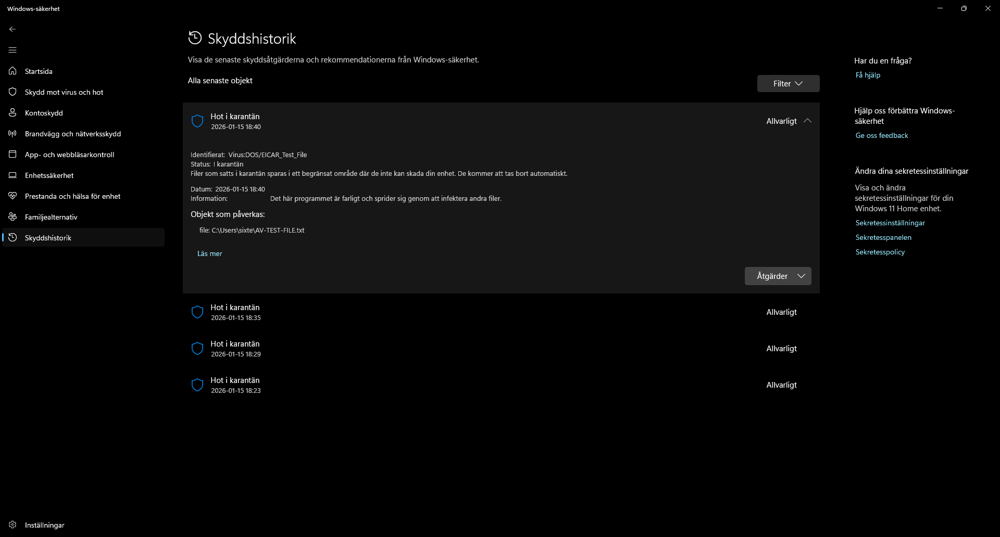

I denna katalog finns min lösning på övning 3 från aplied script kursen. Övningen invållverade att skapa ett program som skapar ett text dokument med en sträng i sig som är till för att testa anti virus program, programmet fungerar endast i Windows miljöer och visar också om AV:en har tagit bort den skapade .txt filen. Detta program är gjort för att pröva AV programs repons till virus inom Windows miljörer.

Bild på Windows defender log och hur karaktänen ser ut:

 
