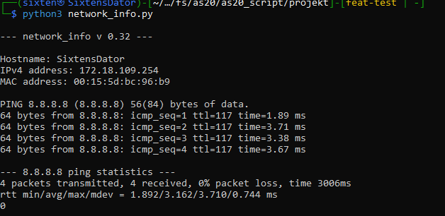

Syfte/mål:
Network_info.py är ett program som skriver ut nätverks information, i nu lägget Host namn, IPv4 och MAC address. För linux användare skriver den även ut hostens boradcast address och subnet mask. Testar användarns uppkoppling mot internet genom att pinga Googles publika DNS server. Målet med detta program är att mer lätt läst presentera nätverks information och pröva hostens uppkoppling mot internetet

Systemkrav:
Linux eller windows miljö
Senaste versionen av python IDE

Instruktioner för körning:
git clone https://github.com/Six10J/as20_script.git
cd as20_script/projekt
chmod +x network_info.py
Linux: python3 network_info.py
Windows: python network_info.py

Programmet är i beta stadiet och så här ser dess output ut, första bilden är in Linux miljö andra i Windows

